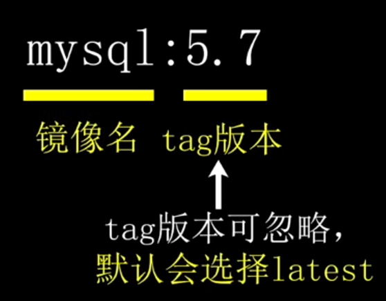
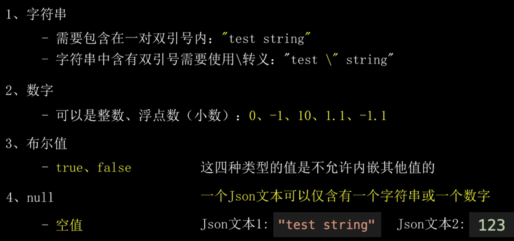

# docker详解

- docker是对单台服务器的环境处理
   - 如果是多台服务器的容器编排，则需要容器集群编排软件

好处：隔离环境，多容器间环境隔离互不影响

## 1.docker工作原理

- docker整体分为：远程镜像仓库，本地镜像、本地容器、docker软件

   ---镜像：容器的模板，等同于安装电脑操作系统的光盘 

   - 远程镜像仓库：云端的镜像仓库，供用户上传、下载镜像，默认是Docker Hub

   - 本地镜像：下载好或者打包好的镜像

   - 本地容器：真正运行的实例，容器是根据镜像创建的，被创建后即可像linux独立使用 

      ​         		---可以理解为独立的linux系统

   - docker软件：连接以上三部分的基石，运行容器的引擎，可跨平台安装

      - 相同镜像可跨平台使用

------

## 2.docker镜像

### 2.1 docker镜像

**容器的模板**，镜像可以理解为安装操作系统的光盘

- 只读
- linux镜像可在linux、windows的docker中使用
- windows镜像只能在windows的docker中使用

### 2.2 镜像名称

两部分：`镜像名：tag版本`

- 不同tag版本的镜像独立
   - 技术上是不依赖关联的

### 2.3 镜像相关命令

------

## 3.docker容器

### 3.1 docker容器

- 真正的运行容器
- 隔离网络、文件、进程等环境
- 一个容器是一个沙盒隔离环境

### 3.2 与虚拟机的区别

docker容器是基于系统内核的容器技术，不需要独立分配物理资源，不需要启动完整的os

- 启动快、轻量
- 多个容器共用宿主机的内存，CPU等物理资源
   - 可能会出现抢占资源的情况

### 3.3 容器与镜像

容器是根据镜像创建的，被创建后即可像linux一样独立使用

- 容器中修改的文件不会同步更新到原来的镜像，也不会影响相同镜像创建的其他容器

- 如果需要将修改后的容器放到别的机器中运行，一般做法：

1. 容器打包成镜像
2. 将镜像上传到远程仓库或打包成镜像文件
3. 在目标机器中下载或导入镜像
4. 根据此镜像生成容器

### 3.4 容器相关命令

------

## 4.容器创建方式

### 4.1 创建方式

两种方法都是基于镜像创建的

- 通过命令直接创建

- 通过dockerfile创建

### 4.2 两种方式的区别

通过命令创建需要完整的docker镜像，通过dockerfile创建镜像可以不完整

​	---docker可以根据dockerfile中的脚本指令进一步完善容器

- 容器被创建后，则容器不再依赖dockerfile

### 4.3 容器创建命令

#### 4.3.1 基础参数

- 设置容器的基础参数：指定cpu、内存限制、后台启动、容器名称等

#### 4.3.2 挂载宿主机目录

- 将宿主机的目录映射到容器中，容器可直接操作宿主机此目录下的文件

#### 4.3.3 网络设置

- 设置容器的网络
- 默认情况，容器的网络是隔离的
   - 即容器内的 `127.0.0.1`指向的是容器本身，而不是宿主机
- 一般是设置端口映射，如将宿主机的8001映射到容器的8080
   - 当访问宿主机的8001端口时，会自动转发到该容器的8080端口
- 如果确定多个容器及宿主机的程序端口不会冲突，可以设置共用宿主机的网络
   - 这样容器内的 127.0.0.1 指向的就是宿主机，容器内的端口也不需要额外映射

#### 4.3.4 环境变量设置

- 设置容器内的环境变量
- 最常用的是设置时区
   - 容器中使用常规设置环境变量的方法是不会生效的
- mysql的镜像可以通过环境变量配置初始密码

#### 4.3.5 容器每次启动执行的命令

- 容器每次启动、重启后执行的命令，一般为shell指令
- 当命令执行完成后，容器会自动停止
- 如果希望容器一直运行不退出，可将执行的命令设置为 `/bin/bash`

#### 4.3.6 通过shell脚本启动多个后台程序

- 如果容器需要启动多个程序，且这些程序都是后台运行，则一般使用shell脚本，脚本中启动相关程序，在脚本的最后添加 /bin/bash ，防止容器自动退出
- 容器中常规的开机启动程序的方法是不会生效的

# Json

## 1.json介绍

- 一种**文本数据格式**
- 一种文本规范，或一种字符串规范
- 优点：可以灵活表示树形结构数据
- 与XML区别：两者类似，但XML更复杂

- **Json本质是一条字符串**
   - 可存储在 .json, .txt, 字符串变量中
- 使用Json数据，需要特定方法转换为对象变量才能使用

## 2.Json规范详解

- 支持6种类型

- 4种常规类型
   - 不允许内嵌其他值

- 2种允许内嵌的值类型

- **json文本中多余的空格、换行不影响实质内容**

